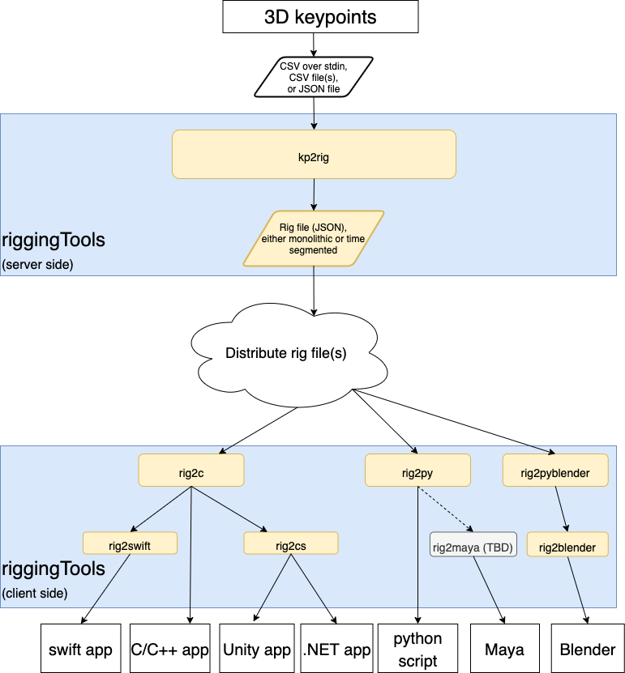

- [**Home**](#about)
  - [**Workflow**](#workflow)
  - [**Server-side tools**](#server-side)
  - [**Client-side tools**](#client-side)
  - [**Samples**](#samples)
  - [**Unit tests**](#tests)
  - [**License**](#license)
- [**How to**](doc/howto.md)
- [**Build**](doc/build.md)
- [**kp2rig**](doc/kp2rig.md)
  - [**Input files**](doc/kp2rigInputFiles.md)
  - [**Output files**](doc/generated-rigs.md)
- [**rig2c**](doc/rig2c.md)

# About

This is a collection of tools bridging the gap between 3D skeletal keypoints and anything that consumes them.

The term ["rig"](doc/generated-rigs.md) is used to define the underlying structure of anything animatable, including humans skeletons, balls (considered a rig with single joint in center), hand-held objects (such as lacrosse sticks), etc;
however, the focus is on creating hierarchical human skeletal rigs with a well-defined root joint.

These tools can help with:
 - converting 3-dimensional keypoints into well-defined and kinematically-correct animatable rigs
 - packaging rigs into files for archival, sharing, or Internet streaming
 - importing rigs into custom code, custom scripts, game engines, and animation software

Design goals for these tools include:
 - require minimum 3rd-party code dependencies for better portability. Distribute dependencies in build tree where possible but allow developers to choose their own dependencies
 - provide CMake builds for everything
 - detach core functionality and data definitions from animation software where possible, enabling flexibility of deployment and future use cases
 - run headless (no GUI) but include bindings for Blender, Unity, and others
 - design for both streaming (live) and static (download) use cases. This infers network bandwidth impact which is why I chose to encode the data
 - use kinematic techniques to interpolate joints that are difficult to label, such as mid-spine
 - use kinematic techniques to assign reasonable bone rolls when legs and arms are straight
 - avoid gimbal lock by performing quaternion calculations where possible
 - handle missing frames internally using SLERP between quaternion angles
 - filter noisy data without compromising full range of motion
 - use command-line arguments where possible (avoid hard-coded values), and print usage if ran without arguments
 - make use of design patterns
 - include basic error checking with human-readable messages
 - have well-commented code (open to interpretation)

# Workflow

# Server-side
[**kp2rig**](doc/kp2rig.md) - C++ terminal application that imports a variety of 3D keypoints and produces unified animatable rigs, either as a monolithic JSON file or JSON file segments.
Depends on [Intel Integrated Performance Primitives (IPP)](https://software.intel.com/en-us/ipp), floating-point compression library [ZFP](https://computing.llnl.gov/projects/floating-point-compression), linear math library [Eigen](http://eigen.tuxfamily.org/index.php?title=Main_Page), json library [nlohmann](https://github.com/nlohmann/json), command-line parser library [CLI11](https://github.com/CLIUtils/CLI11).

# Client-side
[**rig2c**](doc/rig2c.md) - C API that forms the basis for any project consuming a rig. Builds for Windows, Linux, macOS, iOS, Android. Depends on floating-point compression library [ZFP](https://computing.llnl.gov/projects/floating-point-compression), json library [nlohmann](https://github.com/nlohmann/json).

**rig2py** - Python module (#import-able) for consuming rigs. Re-uses code from rig2c. Depends on [python](https://www.python.org/) >=3.5, particularly the C header and lib (python-dev)

**rig2swift** - Swift framework for consuming rigs. Statically links against rig2c. Tested on Mac Catalina and iOS.

**rig2cs** - C# scripts that dynamically wrap rig2c via P/Invoke

**rig2blender** - Python scripts and custom python module that imports rigs into Blender 2.8x.

# Samples
[**worldCoordinates**](samples/worldCoordinates/README.md) - Outputs rig keypoints to files as absolute Cartesian coordinates, and plots one of the frames.
Depends on python helper scripts from [rig2py](rig2py/py/), matplotlib, and mathutils

# Tests
**rig2cTest** - C++ "catch" unit test for rig2c

**rig2csTest** - C# unit test for Windows

**rig2pyTest** - Python unit test for rig2py. Depends on [python](https://www.python.org/) >=3.5

**testIos** - Swift unit test for iOS

## License
MIT license, see the [LICENSE](LICENSE) file for details.
