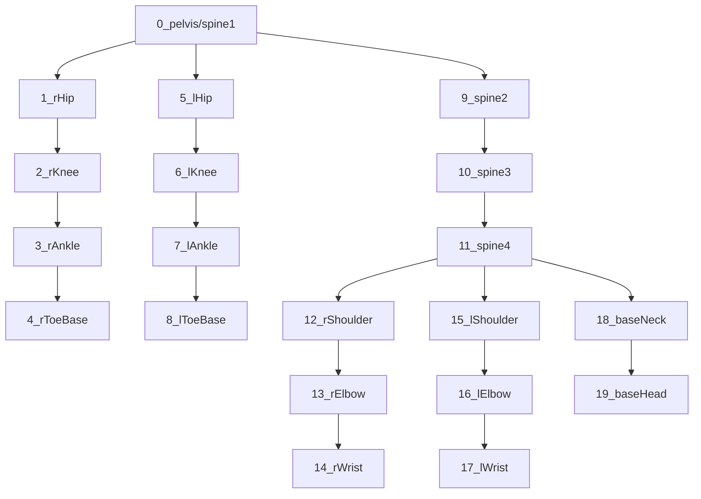

# Rig overview

The term "rig" is used here as an animatable object with at least one non-deformable reference point. This includes humanoid skeletons, balls (considered a rig with single joint at the center), hand-held objects (such as lacrosse sticks), etc. For the rest of this documentation we will focus on humanoid skeletal rigs referred to as **character rigs**.

Character rigs are hierarchical with the pelvis as the root. All joints have an initial "rest pose" where angles are zero - in this case a T-pose. Any joint that deviates from its initial rest pose is represented by a quaternion angle _relative_ to its parent joint. This means if I start with my leg straight, then raise my leg at the hip yet keep my leg straight, the angle of the knee does not change - even though the knee itself has moved in space.
The generated rigs attempt to have kinematically-correct bone rolls. For example, this keeps straight legs from rotating such that the knee points backwards.

Once generated, all rigs (characters or otherwise) are compressed using [ZFP](https://computing.llnl.gov/projects/floating-point-compression), encoded as BASE64, and output as JSON files.

Rigs follow a **right-handed** coordinate system with +y as "up" and +z coming out of the screen:

        +y
         |
         |
         | 
         |-------- +x
        /
       /
     +z

# Character rigs
For any frame in time, a character rig is comprised of up to 4 groups of data:
 - Position
 - Offsets
 - Rotations
 - Bone lengths

Character rigs have the type "humanoid". 

### Position (required)
XYZ of the root joint, in world coordinates.

### Offsets (optional)
3D vectors representing bone offsets.
This applies to joints that don't 'visibly' connect, such as the connection between hips and pelvis.
These can be used directly and do not need to be rotated;
however, they are often ignored, instead using the offsets defined by the model which are then rotated by the parent joint.

| Index | offset root | offset tip    |
| --    | --          | --            |
|   0   |  pelvis     | right hip     |
|   1   |  pelvis     | left hip      |
|   2   |  baseNeck   | right shoulder|
|   3   |  baseNeck   | left shoulder |

### Rotations (optional)
Quaternion values representing the relative orientation of each joint, in XYZW order.
This includes the pelvis which has it's rotation relative to the up-vector.
These are technically optional but in practical usage always present.
 
| Index | offset root |
| --    | -- |
|   0   | pelvis |
|   1   | rHIp |
|   2   | rKnee |
|   3   | rAnkle
|   4   | rToeBase |
|   5   | lHip |
|   6   | lKnee |
|   7   | lAnkle |
|   8   | lToeBase |
|   9   | spine2 |
|   10  | spine3 |
|   11  | spine4 |
|   12  | rShoulder |
|   13  | rElbow |
|   14  | rWrist |
|   15  | lShoulder |
|   16  | lElbow |
|   17  | lWrist |
|   18  | baseNeck |
|   19  | baseHead |

### Lengths (optional)
Bone lengths are provided in case they are useful.
Usually bone lengths are defined by the character model, not the skeleton.
The lengths are an average over the first few frames per character and do not change.

## Joint hierarchy


## Rest pose
The rest pose, or bind pose, is defined as a [T-pose](https://en.wikipedia.org/wiki/T-pose) and has the following characteristics:
 - +Z pointing forward or up
 - +Y pointing along the bone
 - +X ending up wherever
 - arms rotated about the Z axis 90 degrees (π/2) from the pelvis/spine1 vector, one positive and one negative
 - legs rotated about the Z axis 180 degrees (π) from the pelvis/spine1 vector
 - ankle rotated about the X axis 70 degrees (π*7/18) from the leg
 - toebase rotated about the X axis 20 degrees (π/9) from the ankle


# Other rigs
### Ball
A ball rig uses the same basic structure as a humanoid rig and will have the type "ball". Ball includes one pelvis joint representing its orientation.
Ball rigs contain no joint offsets, bone lengths, or other rotations.

### Future rigs
A rig can be just about anything, this is a placeholder section for future rigs.

# File format
The ultimate vision for this is live streaming, so I chose a JSON format because it's simple, portable, and readable.
All floating-point values are compressed using the lossy floating-point compression [ZFP](https://computing.llnl.gov/projects/floating-point-compression) library then wrapped in BASE64 for JSON compliance, which helps keep data sizes reasonable.

A JSON file may any number of rigs, and may contain many frames in a single file or be broken up into streamable segments with fewer frames in each segment.

## Example JSON
A rig JSON file looks like:
```json
{
    "version": "0.3.0",
    "header": {
       "startFrame": 120,
       "endFrame": 149,
       "fps": 30.0,
    },
    "rigs": [ {
       "id": "player1",
       "type": "athelete",
       "name": "johnny-boy",
       "loc": "<ROOT_LOCATIONS>",
       "boneLen": "<BONE_LENGTHS>",
       "boneRot": "<BONE_ROTATIONS>",
       "boneOff": "<BONE_OFFSETS>",
       "numRot": 20,
       "numOff": 4,
       "numLen": 20
    }, {
       "id": "player2",
       "type": "athelete",
       "name": "johnny-appleseed",
       "startFrame": 121,
       "endFrame": 146,
       "loc": "<ROOT_LOCATIONS>",
       "boneLen": "<BONE_LENGTHS>",
       "boneRot": "<BONE_ROTATIONS>",
       "boneOff": "<BONE_OFFSETS>",
       "numRot": 20,
       "numOff": 4,
       "numLen": 20
    }, {
       "id": "ball",
       "type": "ball",
       "name": "ball",
       "loc": "<ROOT_LOCATIONS>",
       "numRot": 1,
       "boneRot": "<BONE_ROTATIONS>"
    } ]
 }
```

## JSON breakdown
 - “version”: 3-digit string version of this JSON format. This might not have nothing to do with the version of the tool that created this
 - “header”: header object containing info that needs to be defined only once per JSON file and applies to all data unless explicitely overridden
   - “startFrame”: integer frame number (timestamp) for the first frame in the data section. This represents an intersection of all objects, and specific characters can override this if necessary but must lie inside this range.
   - “endFrame”: integer frame number (timestamp) for the last frame in the data section. This represents an intersection of all objects, and specific characters can override this if necessary but must lie inside this range.
   - “fps”: floating-point frame rate in terms of frames-per-second
 - “rigs”: array of rigs containing data in the range [“startFrame”,“endFrame”]
   - “id”: unique string ID for this rig
   - “type”: string type or class of rig, often associated with a visual model
   - “name”: string name for this rig, human-readable
   - “startFrame”: integer frame number (timestamp) for the first frame in the data section. This is an optional field used if the start of this frame is different than the header
   - “endFrame”: integer frame number (timestamp) for the last frame in the data section. This is an optional field used if the end of this rig is different than the header
   - “boneLen”: zfp-compressed and then BASE64-encoded bone lengths. These are only defined once, there are no delimiters between values. This is an optional field 
   - “loc”: zfp-compressed and then BASE64-encoded locations of the root joint for each frame. There are no delimiters between values.
   - “rot”: zfp-compressed and then BASE64-encoded rotations for each bone, for each frame. There are no delimiters between values
   - "numRot": integer number of rotation quaternions _per frame_, where each quaternion is comprised of exactly 4 floating-point values. For example, a value of 2 means 8 floating-point values will be decoded. This field also defines how many single floating-point values are in bonLen, assuming a 1-1 relationship between rotations and lengths.
   - "numOff": integer number of offsets _per frame_, where each offset is comprised of exactly 3 floating-point values. Assume zero if not present.
   - "numLen": integer number of lengths _total_, where each length is comprised of exactly 1 floating-point value. The assumption is that lengths never change and only need to be defined once for all frames. Assume zero if not present.
